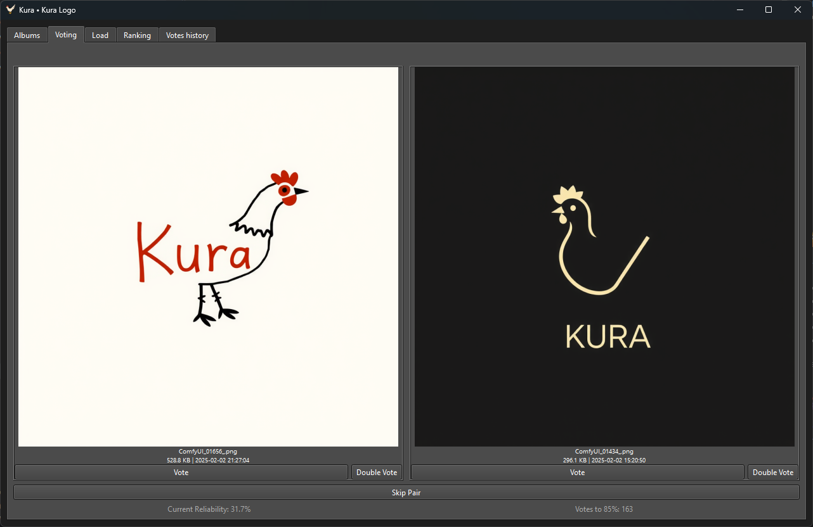
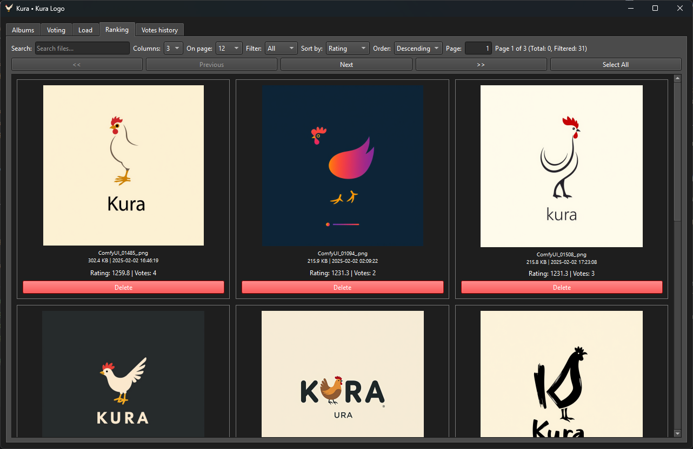

<p align="left"><a href="https://github.com/onlaj/Kura"></a></p>

<h1 align="left">Kura</h1>

 [](https://www.gnu.org/licenses/gpl-3.0)


A Python tool that adapts the Elo ranking system (yes, the one from chess!) to help you sort images and videos through quick comparisons. Perfect for when you've got too many photos to compare manually, but want more nuance than simple star ratings.

<p align="center">
  
  
</p>

## 🤔 What's This For?

Ditch the endless scrolling through similar shots. This works great for:

- Choosing between 20 nearly-identical sunset photos from your trip
- Figuring out which AI-generated avatar actually looks like you
- Running blind tests between camera phones ("Is this really a flagship camera?")
- Finding your best profile picture without bugging friends for opinions
- Organizing your Stable Diffusion outputs by aesthetic quality

Basically: any time you need to sort visual content where personal taste matters more than objective metrics.

## 🕹️ How It Works (Without the Math Lecture)

1. **You compare two items**
2. **The winner's score goes up**, loser's goes down
3. **Surprise wins matter more** (beating a "better" image gives more points)
4. **Repeat** until the rankings feel right

The algorithm automatically:
- Shows you least-voted items first
- Balances comparisons between strong/weak contenders
- Tracks how "settled" the rankings are (via reliability score)


## ✨ Main Features

- **Media Support:** Images (JPG/PNG/WEBP), GIFs, and videos (MP4/MOV/MKV/M4V/WMV/WEBM)
- **Flexible Viewing:** Sort by score/votes/name, fullscreen previews, adjustable grid sizes, video previews
- **Project Management:** Create albums, export/import rankings, handle missing files
- **Transparency:** See every vote in history (and edit if you change your mind)
- **Progress Tracking:** Reliability score shows when you've compared enough pairs ([threshold rationale](docs/reliability_thresholds.md))


## ⌛ Time-Tested Methodology
The Elo ranking system isn't new – it's proven across domains. Here's how others harnessed pairwise comparisons:

* ♟️ **Chess Grandmasters** (1970s)
Arpad Elo's original system revolutionized chess rankings by analyzing millions of player vs. player matches. Your media now benefits from this battle-tested math.

* 👥 **[Facebook's "Facemash"](https://en.wikipedia.org/wiki/History_of_Facebook#Facemash)** (2003)
Mark Zuckerberg's controversial campus site pitted student photos head-to-head, using Elo-like rankings. Kura inherits this viral comparison energy – minus the controversy.

* 📱 **MKBHD Blind Smartphone Tests** (Annual)
Tech reviewer Marques Brownlee uses blind photo comparisons to crown camera champions. "_You’d be shocked how often premium phones lose to mid-range_," he notes – a truth Kura’s neutrality reveals.

* 🎨  **This Very Logo** (2024)
Kura’s hen mascot emerged from 213 AI-generated options, ranked via the same Elo system you’re now looking at. Proof that the algorithm demonstrates its effectiveness.


## ❓Why "Kura"?
**KURA** = **K**een **U**ser-driven **R**anking **A**ssistant  
Pronounced "KOO-rah" (️ [kuːɹɑː])

🐔 **Polish Roots:**
"Kura" means "hen" in Polish – much like hens peck selectively for the best grains, this app helps you pick top-tier media through constant comparisons.

🏯 **Japanese Nuance:** 
The name subtly nods to "kuraberu" (比べる), Japanese for "to compare." 

🏛️ **Latin Legacy:**
From "curare" (to care for) → "curator" – Kura acts as your digital curator, organizing media like a museum expert preserving masterpieces.

## 🚀 Get Started

### **🔹 Option 1: Download Pre-Built Executable**
Pre-built versions of **Kura** are available for **Windows, macOS, and Linux** in the [Releases](https://github.com/onlaj/Kura/releases) section.

> **⚠️ Windows Defender & Antivirus Warning**  
> Some antivirus software (including Windows Defender) may flag the `.exe` as a potential threat. This is a **false positive** caused by the way PyInstaller packages the application.  
> If you see a warning:
> - You can **exclude the file in your antivirus software**
> - Or, use the **manual installation method** below

---

### **🔹 Option 2: Run from Source (Recommended)**
This method ensures the best compatibility and avoids antivirus issues.

**Requirements:**
- **Windows/macOS/Linux**
- **Python 3.9+** (Download from [python.org](https://www.python.org/downloads/))

#### **1. Install Python (if not installed)**
- **Windows:** Download and install Python from [python.org](https://www.python.org/downloads/). Ensure you check the box **"Add Python to PATH"** during installation.
- **macOS/Linux:** Python 3 is usually pre-installed. Check by running `python3 --version`.

#### **2. Clone & Set Up the Project**
```bash
# Download the project
git clone https://github.com/onlaj/Kura.git
cd Kura
```

#### **3. Create a Virtual Environment**
```bash
# Linux/macOS
python3 -m venv venv
source venv/bin/activate

# Windows
python -m venv venv
venv\Scripts\activate
```

#### **4. Install Dependencies & Run**
```bash
# Ensure pip is up to date
python -m pip install --upgrade pip

# Install required packages
python -m pip install -r requirements.txt

# Run the application
python main.py
```

Now, the app should start! 🚀


Creating onefile executable:
```
pyinstaller --onefile --windowed --icon="docs/favicon.ico" --add-data "docs/logo.png;docs" main.py
```