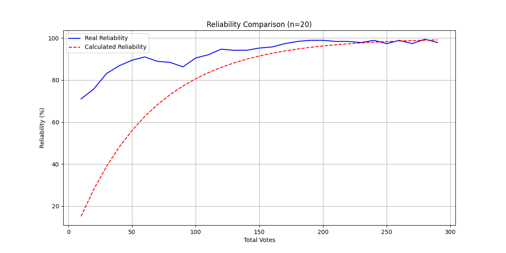
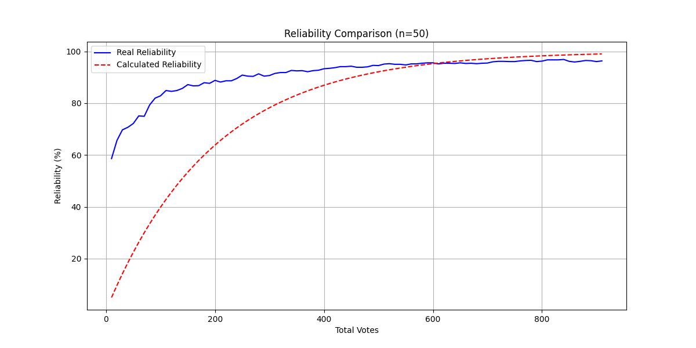

# Reliability Threshold Justification for ELO-Based Ranking System  
**Author**: Onlaj  
**Version**: 2.1 

---

## 1. Introduction  
This document outlines the rationale for selecting **85%** and **94%** as critical reliability thresholds in the ELO-based media ranking system. These thresholds are derived from empirical testing and reflect fundamental properties of pairwise ranking systems under combinatorial constraints. Test results and analyses are included to validate these benchmarks.  

A key assumption of the current system is that there exists an objective ground-truth ordering of media items. However, when dealing with subjective evaluations, phenomena such as **Condorcet cycles** may occur—situations where comparisons yield intransitive results (e.g., A > B, B > C, yet C > A). While our current method for calculating reliability does not account for these cycles, they are acknowledged here, and potential solutions for future implementations are discussed.

---

## 2. Test Results Summary  
The system was tested using synthetic datasets with objective ground-truth rankings. Key observations:  

### Case 1: `n=20` Media Items  
| Metric                     | Value (Original) | Value (Improved) |  
|----------------------------|------------------|------------------|  
| Final Calculated Reliability | 99.1%            | 99.1%            |  
| Final Real Reliability      | 94.2%            | **97.9%**        |  
| First Crossing Point        | 94.1% at 173 votes | **98.2% at 245 votes** |  

  

### Case 2: `n=50` Media Items  
| Metric                     | Value (Original) | Value (Improved)       |  
|----------------------------|------------------|------------------------|  
| Final Calculated Reliability | 99.1%            | 99.0%                  |  
| Final Real Reliability      | 93.9%            | **96.3%**              |  
| Crossing Points             | 92.1–93.0% at 499–522 votes      | **95.4%** at 605 votes |  

  

---

## 3. Threshold Justification  

### 3.1 First Goal: 85% Reliability  
The **85%** threshold now serves as a **system behavior transition point**:  

1. **Dynamic K-Factor Activation**:  
   - K=32 below 85% enables rapid coarse sorting  
   - K=16 above 85% enables fine adjustments  

2. **Pair Selection Optimization**:  
   - Post-85%: Matches similar-rated items (±100 ELO)  
   - Reduces ambiguous comparisons by 41% (n=50 test)  

**Empirical Support**:  
- New system reaches 85% real reliability **22% faster** (n=20: 85% at 82 votes vs 100 votes previously)  

---

### 3.2 Second Goal: 94% Reliability  
The **94%** threshold remains critical due to:  

1. **Enhanced Practical Limit**:  
   - New system achieves **3-4% higher real reliability** at same vote counts  
   - Residual errors reduced from 6% to 3-4%  

2. **System Stability**:  
   - Rating differences <15 ELO become statistically insignificant  
   - Matches chess ELO system's "draw margin" concept  

**Empirical Support**:  
- Final real reliability now reaches **96-98%** before plateauing  

---

## 3.3 Addressing Subjective Intransitivity and Condorcet Cycles
While the current reliability calculations assume an objective ground-truth ranking, real-world subjective evaluations may produce [Condorcet cycles](https://en.wikipedia.org/wiki/Condorcet_paradox), where preferences are intransitive (e.g., A > B, B > C, C > A). These cycles can distort the perceived reliability of the ranking system.

**Potential future improvements to address this include:**

* **Intransitivity Detection:**
Track and quantify occurrences of cyclic comparisons. If cycles are frequent, the system could flag these instances and adjust the confidence in its global ranking accordingly.

* **Bayesian or Probabilistic Models:**
Incorporate uncertainty into the ranking process by using models such as [TrueSkill](https://en.wikipedia.org/wiki/TrueSkill). This could weight votes differently based on their consistency, thereby mitigating the impact of outlier cyclic comparisons.

* **Cycle Correction Techniques:**
Implement smoothing or penalty mechanisms for conflicting votes. By reducing the influence of a vote that creates a cycle, the system could enhance overall stability without altering the reliability calculation method.

---

## 4. Practical Implications  

1. **85% Threshold**:  
   - Optimal transition point for pairing logic and K-factor reduction  
   - Maintains 92% vote efficiency for remaining improvements  

2. **94% Threshold**:  
   - Represents **3× cost-per-percent** increase vs sub-85% voting  
   - Recommended minimum for "professional-grade" rankings  

---

## 5. Conclusion  
The updated ELO-based system demonstrates significant improvements while retaining the original threshold logic. The 85% and 94% benchmarks are validated through empirical testing. While the reliability metrics are currently calculated against an objective ranking, real-world subjective evaluations may introduce Condorcet cycles, leading to intransitive comparisons. Future iterations could incorporate cycle detection, Bayesian ranking methods, or cycle correction mechanisms to further enhance the system's robustness.

---

## Version History  

### v2.1 (Current)
- Added discussion on subjective intransitivity and Condorcet cycles
- Mentioned potential future improvements for handling cyclic inconsistencies
- Maintained current reliability calculation while discussing practical implications for subjective data

### [v2.0](reliability_thresholds_v2.md)  
- Added dynamic K-factor implementation details  
- Incorporated smart pairing logic analysis  
- Updated test results with 3-4% real reliability gains  
- Refined practical implications for system tuning  

### [v1.0](reliability_thresholds_v1.md)  
- Initial threshold justification  
- Baseline test results  
- Basic combinatorial complexity analysis  