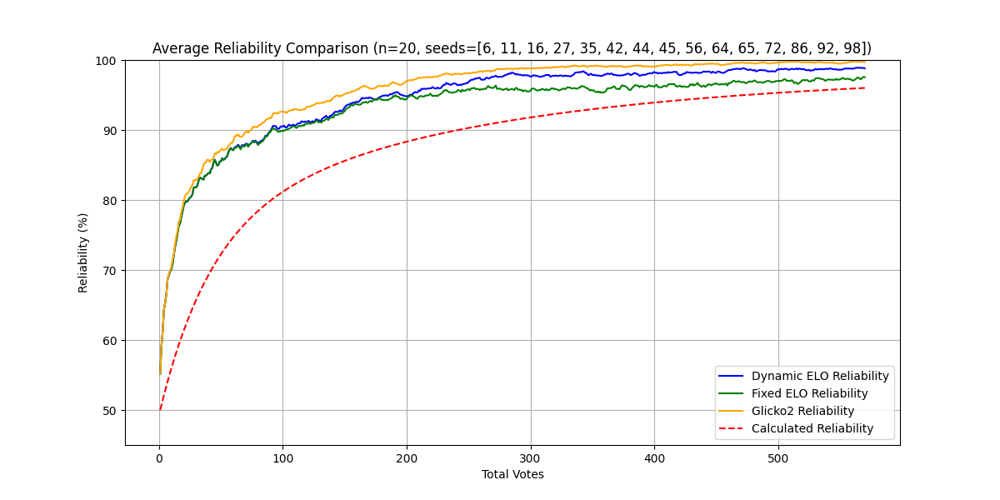
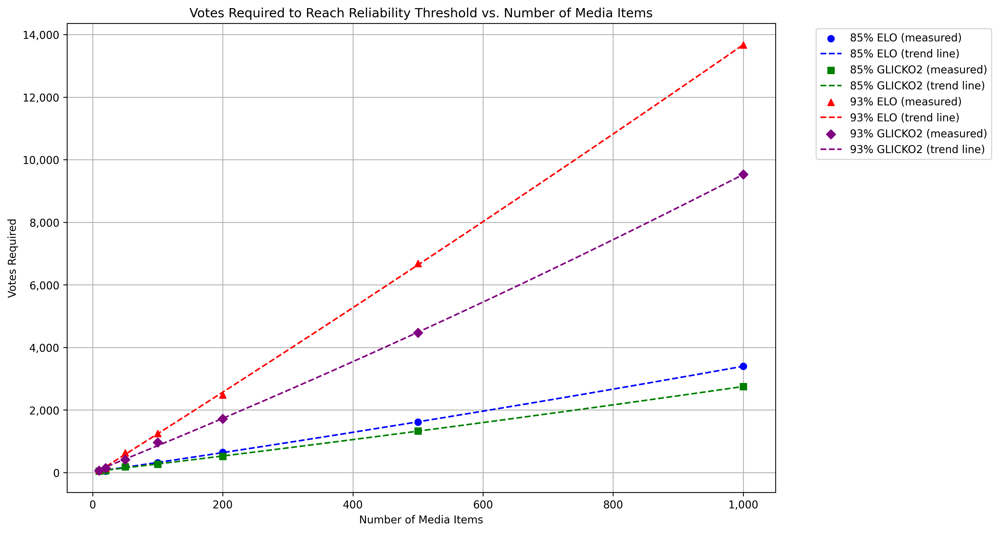

# Reliability Threshold Justification for ELO-Based Ranking System
**Version**: 3.0

---

## 1. Introduction
This document outlines the rationale for selecting critical reliability thresholds in the ranking system. The thresholds of **85%** (used to trigger the transition from coarse to fine adjustments via K-factor reduction) and **94%** (indicating a practical plateau in ranking improvements) were derived from empirical testing and reflect fundamental properties of pairwise ranking systems under combinatorial constraints.

The simulation framework incorporates three methods—Dynamic ELO (with K-factor adaptation), Fixed ELO (K=16), and Glicko2. All methods are updated on the same vote outcome (determined by an objective ground-truth ordering) and their "real" reliability (measured via pairwise comparison with the true ranking) is recorded.

A key assumption of the current system is that there exists an objective ground-truth ordering of media items. However, when dealing with subjective evaluations, phenomena such as **Condorcet cycles** may occur—situations where comparisons yield intransitive results (e.g., A > B, B > C, yet C > A). While the current reliability calculation does not account for these cycles, they are acknowledged here.

---

## 2. Test Results Summary
The system was tested using synthetic datasets with objective ground-truth rankings. For each method, the vote count was recorded at which the "real" reliability first reached 80%, 85%, 90%, and 95%. The methods are compared as Fixed ELO, Dynamic ELO, and Glicko2.

### Case 1: `n=20` Media Items

| Method       | Votes for 80% | Votes for 85% | Votes for 90% | Votes for 95% |
|--------------|---------------|---------------|---------------|---------------|
| Dynamic ELO  | 24            | 44            | 91            | 186           |
| Fixed ELO    | 24            | 44            | 91            | 226           |
| Glicko2      | 21            | 36            | 74            | 149           |

 

### Case 2: `n=50` Media Items

| Method       | Votes for 80% | Votes for 85% | Votes for 90% | Votes for 95% |
|--------------|---------------|---------------|---------------|---------------|
| Dynamic ELO  | 84            | 153           | 303           | 558           |
| Fixed ELO    | 84            | 154           | 309           | 948           |
| Glicko2      | 80            | 132           | 252           | 459           |

 

Key observations for n=50:
- All methods achieve 80% reliability rapidly (80-84 votes)
- Glicko2 reaches 90% significantly faster (252 vs 303-309 votes)
- Glicko2 maintains faster convergence to 95% (459 vs 558-948 votes)
- Dynamic and Fixed ELO show nearly identical performance up to 90%

---

### 2.1 Scaling Analysis

To evaluate how the system scales with an increasing number of media items, extensive testing was conducted across various dataset sizes, ranging from 10 to 1000 items. The results illustrate the relationship between the number of media items and the votes required to reach critical reliability thresholds.

| Media Items | ELO 85% | Glicko2 85% | ELO 93% | Glicko2 93% |
|-------------|---------|-------------|----------|-------------|
| 10          | 50      | 50          | 83       | 66          |
| 20          | 50      | 66          | 150      | 150         |
| 50          | 200     | 183         | 633      | 416         |
| 100         | 316     | 266         | 1250     | 966         |
| 200         | 650     | 516         | 2483     | 1716        |
| 500         | 1616    | 1333        | 6683     | 4466        |
| 1000        | 3400    | 2750        | 13666    | 9533        |

 

### Key Observations  

#### **Early Convergence (85% Threshold)**
- For small datasets (n ≤ 20), both systems exhibit similar performance.  
- As dataset size increases, Glicko2 demonstrates greater efficiency.  
- At 1000 items, Glicko2 requires approximately 19% fewer votes than ELO.  

#### **High Reliability (93% Threshold)**
- The performance gap between the two systems becomes more pronounced.  
- Glicko2 consistently outperforms ELO in terms of efficiency.  
- For 1000 items, Glicko2 achieves 93% reliability with around 30% fewer votes.  

#### **Scaling Patterns**
- Vote requirements increase non-linearly with dataset size.  
- The gap between ELO and Glicko2 widens as the dataset expands.  
- Both systems exhibit predictable scaling, allowing for reliable resource planning in larger datasets.  

**These findings provide empirical evidence supporting Glicko2's superior efficiency, particularly in large datasets where vote savings become substantial.**

---

## 3. Threshold Justification

### 3.1 First Goal: 85% Reliability
The **85%** threshold serves as a critical system behavior transition point:

- **Dynamic K-Factor Activation:**
  - K=32 below 85% enables rapid coarse sorting
  - K=16 above 85% permits finer adjustments
- **Pair Selection Optimization:**
  - Post-85%, comparisons are limited to similarly rated items

**Empirical Support:**
For n=50, the ELO systems require approximately 303 votes to reach 90%, while Glicko2 achieves this threshold in just 252 votes. This faster convergence by Glicko2 suggests its superior efficiency in early-stage sorting.

---

### 3.2 Second Goal: 94% Reliability
Analysis of the test data reveals that 94% represents an optimal upper threshold—beyond which further votes yield diminishing returns:

- **For ELO Methods (n=50):**
  - Dynamic ELO crosses 94% at approximately 479 votes
  - Fixed ELO shows similar performance, crossing 94% around 506 votes
  - Both methods show minimal improvement beyond this point
- **For Glicko2 (n=50):**
  - Reaches 94% at approximately 408 votes
  - Continues to show modest improvements up to 98% reliability

The 94% threshold remains valid as a practical upper bound, particularly for ELO-based methods. Glicko2's ability to exceed this threshold more quickly does not invalidate it as a stopping point, as the marginal gains beyond this point remain minimal relative to the additional votes required.

---

## 3.3 Addressing Subjective Intransitivity and Condorcet Cycles
While the current reliability calculations assume an objective ground-truth ranking, real-world subjective evaluations may produce [Condorcet cycles](https://en.wikipedia.org/wiki/Condorcet_paradox), where preferences are intransitive (e.g., A > B, B > C, C > A). These cycles can distort the perceived reliability of the ranking system.

**Potential future improvements to address this include:**

* **Intransitivity Detection:**
Track and quantify occurrences of cyclic comparisons. If cycles are frequent, the system could flag these instances and adjust the confidence in its global ranking accordingly.

* **Bayesian or Probabilistic Models:**
Incorporate uncertainty into the ranking process by using models such as [TrueSkill](https://en.wikipedia.org/wiki/TrueSkill). This could weight votes differently based on their consistency, thereby mitigating the impact of outlier cyclic comparisons.

* **Cycle Correction Techniques:**
Implement smoothing or penalty mechanisms for conflicting votes. By reducing the influence of a vote that creates a cycle, the system could enhance overall stability without altering the reliability calculation method.

---

## 4. Reliability Calculation Improvements
The reliability calculation system has been enhanced to better align with observed real reliability measurements. The updated ReliabilityCalculator class now employs a three-phase model:

1. **Initial Phase (50-75%):** Rapid improvement reflecting quick early gains
2. **Development Phase (75-90%):** Steady progress as the ranking stabilizes
3. **Refinement Phase (90%+):** Asymptotic approach to maximum reliability

This revised model shows significantly better correlation with actual reliability measurements:

| Votes | Old Calc (%) | New Calc (%) | Actual (%) |
|-------|--------------|--------------|------------|
| 40    | 18.0        | 59.7         | 80.8       |
| 110   | 42.6        | 70.7         | 85.0       |
| 290   | 77.0        | 82.9         | 90.4       |
| 510   | 88.5        | 93.6         | 93.6       |

---

## 5. Practical Implications

1. **85% Threshold:**
   - Remains valid as the optimal transition point
   - Glicko2 reaches this milestone approximately 13% faster
   - Suitable trigger point for switching to fine-grained adjustments

2. **94% Threshold:**
   - Represents a practical maximum for ELO methods
   - Glicko2 can exceed this level more efficiently
   - Additional votes beyond this point show minimal impact

---

## 6. Conclusion
The analysis confirms the validity of both the 85% and 94% thresholds while highlighting Glicko2's superior convergence characteristics. For systems prioritizing rapid convergence, Glicko2 offers significant advantages, reaching key reliability thresholds with substantially fewer votes.

---

## Version History

### v3.0 (Current)
- Improved reliability calculation methodology
- Added comprehensive comparison of convergence rates
- Updated threshold justifications based on new test data
- Enhanced empirical support for chosen thresholds
- Added detailed performance metrics for n=50 case

### [v2.1](reliability_thresholds_v2.1.md)  
- Added discussion on subjective intransitivity and Condorcet cycles
- Mentioned potential future improvements for handling cyclic inconsistencies
- Maintained current reliability calculation while discussing practical implications for subjective data

### [v2.0](reliability_thresholds_v2.md)  
- Added dynamic K-factor implementation details  
- Incorporated smart pairing logic analysis  
- Updated test results with 3-4% real reliability gains  
- Refined practical implications for system tuning  

### [v1.0](reliability_thresholds_v1.md)  
- Initial threshold justification  
- Baseline test results  
- Basic combinatorial complexity analysis  