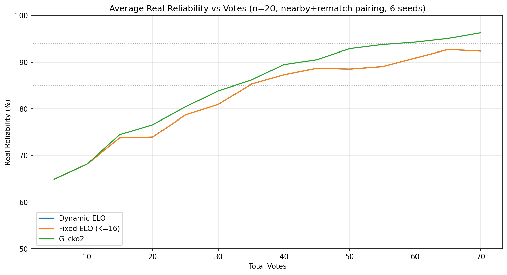
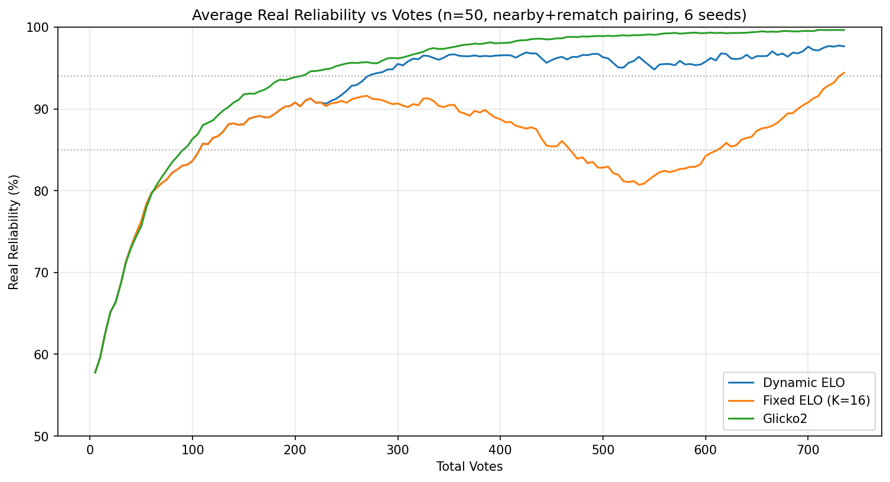
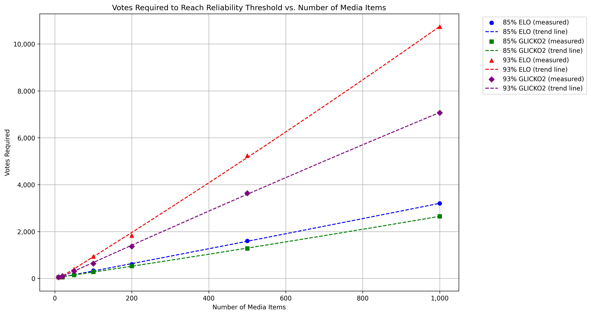
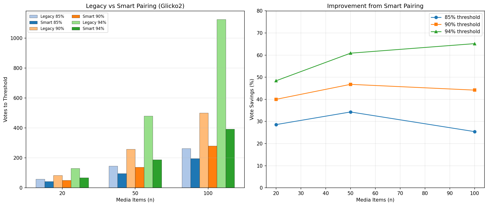

# Reliability Threshold Justification for ELO-Based Ranking System
**Version**: 4.0

---

## 1. Introduction
This document outlines the rationale for selecting critical reliability thresholds in the ranking system. The thresholds of **85%** (used to trigger the transition from coarse to fine adjustments via K-factor reduction) and **94%** (indicating a practical plateau in ranking improvements) were derived from empirical testing and reflect fundamental properties of pairwise ranking systems under combinatorial constraints.

Version 4 re-measures convergence under the production pairing improvements (rating-nearby opponents + rematch avoidance; Glicko albums additionally prefer high-uncertainty items) and the recalibrated `ReliabilityCalculator` (system-aware Elo vs Glicko curves, optional mean-φ blending). Glicko-2 volatility (σ) is now solved with the Illinois algorithm from Glickman 2012 rather than left unchanged.

The simulation framework incorporates three methods—Dynamic ELO (with K-factor adaptation), Fixed ELO (K=16), and Glicko2. For the shared-outcome method comparison, all three are updated on the same vote sequence (objective ground-truth winner) using least-voted + rating-nearby pairing with rematch avoidance. Production Glicko pairing (high-φ primary) is evaluated separately in §2.2.

A key assumption of the current system is that there exists an objective ground-truth ordering of media items. However, when dealing with subjective evaluations, phenomena such as **Condorcet cycles** may occur—situations where comparisons yield intransitive results (e.g., A > B, B > C, yet C > A). While the current reliability calculation does not account for these cycles, they are acknowledged here.

---

## 2. Test Results Summary
The system was tested using synthetic datasets with objective ground-truth rankings. For each method, the vote count was recorded at which the "real" reliability first reached 80%, 85%, 90%, and 95% (averaged over 6 seeds).

### Case 1: `n=20` Media Items

| Method       | Votes for 80% | Votes for 85% | Votes for 90% | Votes for 95% |
|--------------|---------------|---------------|---------------|---------------|
| Dynamic ELO  | 28            | 38            | 49            | 96            |
| Fixed ELO    | 28            | 38            | 49            | 98            |
| Glicko2      | 27            | 33            | 44            | 66            |

Compared with [v3.0](reliability_thresholds_v3.md) (legacy random pairing): Glicko2 reaches 90% in **44** votes vs **74**, and 95% in **66** vs **149**.

### Case 2: `n=50` Media Items

| Method       | Votes for 80% | Votes for 85% | Votes for 90% | Votes for 95% |
|--------------|---------------|---------------|---------------|---------------|
| Dynamic ELO  | 67            | 105           | 187           | 291           |
| Fixed ELO    | 67            | 105           | 187           | 752           |
| Glicko2      | 66            | 93            | 130           | 229           |

Key observations for n=50:
- All methods still reach 80% rapidly (~66–67 votes)
- Glicko2 reaches 90% in **130** votes (v3: 252); Dynamic ELO in **187** (v3: 303)
- Dynamic ELO pulls away from Fixed ELO above 90% (291 vs 752 votes to 95%) because the K=32→16 transition keeps early sorting aggressive
- Glicko2 remains the fastest path to 95% (229 votes)

Votes to **94%** real reliability (n=50): Dynamic ELO ≈ **273**, Fixed ELO ≈ **738**, Glicko2 ≈ **204**.

---

### 2.1 Scaling Analysis

Extensive testing across dataset sizes from 10 to 1000 items (3 seeds, nearby+rematch pairing shared by Elo and Glicko):

| Media Items | ELO 85% | Glicko2 85% | ELO 93% | Glicko2 93% |
|-------------|---------|-------------|---------|-------------|
| 10          | 50      | 50          | 66      | 50          |
| 20          | 50      | 50          | 100     | 100         |
| 50          | 166     | 150         | 400     | 316         |
| 100         | 333     | 283         | 933     | 633         |
| 200         | 600     | 533         | 1833    | 1366        |
| 500         | 1600    | 1283        | 5233    | 3633        |
| 1000        | 3200    | 2650        | 10733   | 7066        |

#### Early Convergence (85% Threshold)
- Small albums (n ≤ 20) remain essentially tied.
- At 1000 items, Glicko2 needs about **17%** fewer votes than Elo (2650 vs 3200).

#### High Reliability (93% Threshold)
- The gap widens: at 1000 items Glicko2 needs about **34%** fewer votes (7066 vs 10733).
- Absolute vote counts are lower than v3 for both systems because rematch-aware nearby pairing reduces wasted comparisons.

#### Scaling Patterns
- Vote requirements still grow roughly with album size (slightly super-linear at high reliability).
- Glicko2’s advantage remains largest when targeting 93%+.

---

### 2.2 Pairing Efficiency (Legacy vs Production Smart Pairing)

Production Glicko albums pick the highest-φ (most uncertain) item first, then a rating-nearby opponent, excluding previously compared edges when alternatives exist. Against legacy least-voted + random opponent pairing, this cuts votes to real reliability thresholds substantially:

| n   | Threshold | Legacy Votes | Smart Votes | Savings |
|-----|-----------|--------------|-------------|---------|
| 20  | 85%       | 58           | 42          | 29%     |
| 20  | 90%       | 83           | 50          | 40%     |
| 20  | 94%       | 129          | 67          | 48%     |
| 50  | 85%       | 146          | 96          | 34%     |
| 50  | 90%       | 258          | 138         | 47%     |
| 50  | 94%       | 479          | 188         | 61%     |
| 100 | 85%       | 262          | 196         | 25%     |
| 100 | 90%       | 500          | 279         | 44%     |
| 100 | 94%       | 1125         | 392         | 65%     |

**Real-life takeaway:** for a typical Glicko album, uncertainty-aware pairing + rematch avoidance can save roughly **25–65%** of votes depending on album size and target reliability—largest gains appear near the 94% plateau.

---

## 3. Threshold Justification

### 3.1 First Goal: 85% Reliability
The **85%** threshold remains the system behavior transition point:

- **Dynamic K-Factor Activation:**
  - K=32 below 85% enables rapid coarse sorting
  - K=16 above 85% permits finer adjustments
- **UI milestone:** “Votes to 85%” is the first progress target shown while reliability is still low

**Empirical Support:**
For n=50 with improved pairing, Dynamic ELO reaches 85% real reliability at ~105 votes and 90% at ~187; Glicko2 reaches 85% at ~93 and 90% at ~130. The 85% cutover still sits in the steep early portion of the curve.

---

### 3.2 Second Goal: 94% Reliability
94% remains a practical upper threshold—beyond which further votes yield diminishing returns:

- **For ELO Methods (n=50):**
  - Dynamic ELO crosses 94% at approximately **273** votes
  - Fixed ELO is much slower (~**738**), underscoring the value of the dynamic K schedule
- **For Glicko2 (n=50):**
  - Shared-pairing Glicko reaches 94% at approximately **204** votes
  - Production high-φ pairing reaches 94% even sooner (~**188** votes; see §2.2)

The 94% threshold remains valid as a practical stopping / “album is settled” target. Glicko2’s faster path does not invalidate it; marginal gains past 94% still cost disproportionate additional votes.

---

## 3.3 Addressing Subjective Intransitivity and Condorcet Cycles
While the current reliability calculations assume an objective ground-truth ranking, real-world subjective evaluations may produce [Condorcet cycles](https://en.wikipedia.org/wiki/Condorcet_paradox), where preferences are intransitive (e.g., A > B, B > C, C > A). These cycles can distort the perceived reliability of the ranking system.

**Potential future improvements to address this include:**

* **Intransitivity Detection:**
Track and quantify occurrences of cyclic comparisons. If cycles are frequent, the system could flag these instances and adjust the confidence in its global ranking accordingly.

* **Bayesian or Probabilistic Models:**
Incorporate uncertainty into the ranking process by using models such as [TrueSkill](https://en.wikipedia.org/wiki/TrueSkill). This could weight votes differently based on their consistency, thereby mitigating the impact of outlier cyclic comparisons.

* **Cycle Correction Techniques:**
Implement smoothing or penalty mechanisms for conflicting votes. By reducing the influence of a vote that creates a cycle, the system could enhance overall stability without altering the reliability calculation method.

---

## 4. Reliability Calculation Improvements
The UI reliability estimate is now **system-aware** and calibrated to the empirical vote densities above:

1. **Initial Phase:** Rapid early gains as coarse order appears
2. **Development Phase:** Mid-stage sorting as nearby comparisons refine ranks
3. **Refinement Phase:** Asymptotic approach to the ceiling

Additional v4 behaviors:
- **Elo albums** stretch effective votes-per-item (×0.70) so the same 85%/94% UI targets require denser history (~12 vpi for 94% at large n)
- **Glicko albums** use the faster curve (~8.3 vpi for 94%) and may blend mean residual RD (φ) for a small additional boost once uncertainty has collapsed
- **Required-votes** search uses the same parameters, so “Votes to 94%” matches the calibrated curve

Correlation with measured Glicko real reliability (n=50, averaged curves; Glicko calc includes live mean-φ blend):

| Votes | Old Calc (%) | Elo Calc (%) | Glicko Calc (%) | Actual Glicko (%) |
|-------|--------------|--------------|-----------------|-------------------|
| 40    | 59.9         | 62.2         | 67.4            | 73.0              |
| 110   | 70.8         | 75.0         | 81.5            | 88.0              |
| 290   | 83.0         | 87.7         | 92.1            | 96.2              |
| 510   | 88.6         | 92.9         | 95.8            | 98.9              |

The previous single curve needed ~20 votes/item to report 94%; the Glicko UI curve now reaches that target near ~8.3 votes/item (Elo ~12), which tracks large-*n* 93% scaling within a few percent.

The UI curve remains **intentionally conservative** versus measured real reliability: at n=50, Glicko real reliability hits 94% around ~188–204 votes under smart/shared pairing, while `calculate_required_votes` still reports ~413 (~2×). Early milestones (85%) are also somewhat high versus the scaling table. Progress text therefore understates how settled an album already is, rather than declaring “done” too early.

---

## 5. Practical Implications

1. **85% Threshold:**
   - Remains the optimal Dynamic-Elo K-factor transition and first UI milestone
   - Glicko2 still reaches it earlier than Elo at larger n

2. **94% Threshold:**
   - Remains a practical plateau / “done enough” target
   - Production smart pairing can cut votes to 94% by ~50–65% vs legacy random pairing

3. **Prefer Glicko2 for new albums** when vote efficiency matters; treat UI “votes remaining” as a conservative upper bound on work left.

---

## 6. Conclusion
The 85% and 94% thresholds remain justified. Uncommitted ranking/reliability work delivers measurable real-world gains: fewer votes to each reliability milestone (especially under production Glicko pairing), a system-aware calculator that is much closer to empirical densities than the old ~20 vpi curve (while still conservative at typical album sizes), and correct Glicko volatility updates. Glicko2 continues to outperform Elo at high reliability, and the gap is largest when albums are large and the target is 93%+.

---

## Version History

### v4.0 (Current)
- Re-ran method comparison and scaling sims under nearby + rematch-aware pairing
- Documented production Glicko high-φ pairing gains (legacy vs smart delta graph)
- Recalibrated ReliabilityCalculator (Elo vs Glicko curves, optional mean-φ blend)
- Noted Glicko-2 Illinois σ solver fix
- Regenerated avg, scaling, and pairing-improvement graphs

### [v3.0](reliability_thresholds_v3.md)
- Improved reliability calculation methodology
- Added comprehensive comparison of convergence rates
- Updated threshold justifications based on new test data
- Enhanced empirical support for chosen thresholds
- Added detailed performance metrics for n=50 case

### [v2.1](reliability_thresholds_v2.1.md)
- Added discussion on subjective intransitivity and Condorcet cycles
- Mentioned potential future improvements for handling cyclic inconsistencies
- Maintained current reliability calculation while discussing practical implications for subjective data

### [v2.0](reliability_thresholds_v2.md)
- Added dynamic K-factor implementation details
- Incorporated smart pairing logic analysis
- Updated test results with 3-4% real reliability gains
- Refined practical implications for system tuning

### [v1.0](reliability_thresholds_v1.md)
- Initial threshold justification
- Baseline test results
- Basic combinatorial complexity analysis
