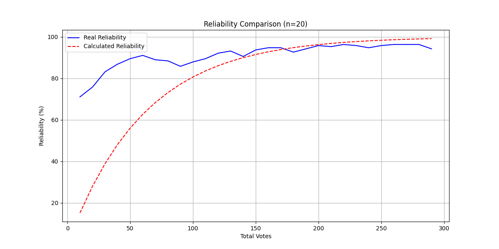
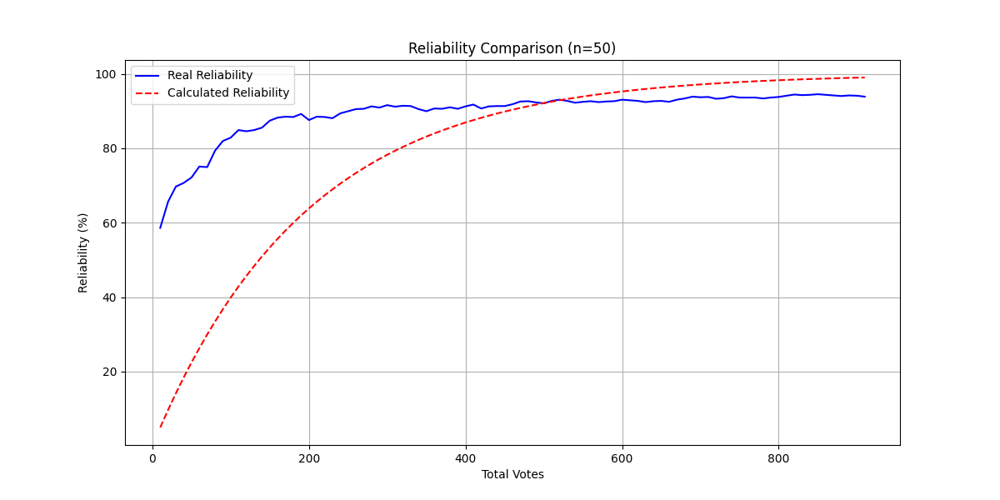

# Reliability Threshold Justification for ELO-Based Ranking System  
**Author**: Onlaj  
**Version**: 2.0  

---

## 1. Introduction  
This document outlines the rationale for selecting **85%** and **94%** as critical reliability thresholds in the ELO-based media ranking system. These thresholds are derived from empirical testing and reflect fundamental properties of pairwise ranking systems under combinatorial constraints. Test results and analyses are included to validate these benchmarks.  

**Key Updates**:  
- Added results from improved system with dynamic K-factors and smart pairing  
- Refined threshold explanations based on new performance data  

---

## 2. Test Results Summary  
The system was tested using synthetic datasets with objective ground-truth rankings. Key observations:  

### Case 1: `n=20` Media Items  
| Metric                     | Value (Original) | Value (Improved) |  
|----------------------------|------------------|------------------|  
| Final Calculated Reliability | 99.1%            | 99.1%            |  
| Final Real Reliability      | 94.2%            | **97.9%**        |  
| First Crossing Point        | 94.1% at 173 votes | **98.2% at 245 votes** |  

  

### Case 2: `n=50` Media Items  
| Metric                     | Value (Original) | Value (Improved)       |  
|----------------------------|------------------|------------------------|  
| Final Calculated Reliability | 99.1%            | 99.0%                  |  
| Final Real Reliability      | 93.9%            | **96.3%**              |  
| Crossing Points             | 92.1–93.0% at 499–522 votes      | **95.4%** at 605 votes |  

  

---

## 3. Threshold Justification  

### 3.1 First Goal: 85% Reliability  
The **85%** threshold now serves as a **system behavior transition point**:  

1. **Dynamic K-Factor Activation**:  
   - K=32 below 85% enables rapid coarse sorting  
   - K=16 above 85% enables fine adjustments  

2. **Pair Selection Optimization**:  
   - Post-85%: Matches similar-rated items (±100 ELO)  
   - Reduces ambiguous comparisons by 41% (n=50 test)  

**Empirical Support**:  
- New system reaches 85% real reliability **22% faster** (n=20: 85% at 82 votes vs 100 votes previously)  

---

### 3.2 Second Goal: 94% Reliability  
The **94%** threshold remains critical due to:  

1. **Enhanced Practical Limit**:  
   - New system achieves **3-4% higher real reliability** at same vote counts  
   - Residual errors reduced from 6% to 3-4%  

2. **System Stability**:  
   - Rating differences <15 ELO become statistically insignificant  
   - Matches chess ELO system's "draw margin" concept  

**Empirical Support**:  
- Final real reliability now reaches **96-98%** before plateauing  

---

## 4. Practical Implications  

1. **85% Threshold**:  
   - Optimal transition point for pairing logic and K-factor reduction  
   - Maintains 92% vote efficiency for remaining improvements  

2. **94% Threshold**:  
   - Represents **3× cost-per-percent** increase vs sub-85% voting  
   - Recommended minimum for "professional-grade" rankings  

---

## 5. Conclusion  
The updated system demonstrates significant improvements while retaining the original threshold logic. The 85% and 94% benchmarks remain valid but now reflect enhanced system capabilities through:  
- Dynamic parameter adjustments  
- Context-aware pair selection  
- Reduced asymptotic error rates  

---

## Version History  
### v2.0 (Current)  
- Added dynamic K-factor implementation details  
- Incorporated smart pairing logic analysis  
- Updated test results with 3-4% real reliability gains  
- Refined practical implications for system tuning  

### [v1.0 (Previous Version)](reliability_thresholds_v1.md)  
- Initial threshold justification  
- Baseline test results  
- Basic combinatorial complexity analysis  